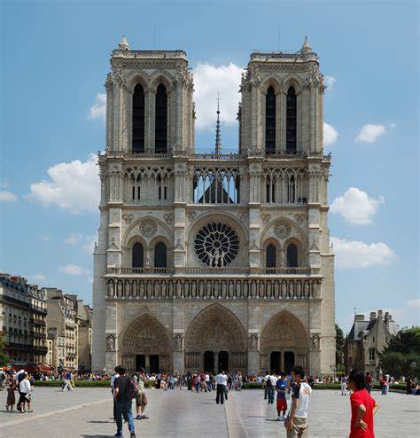
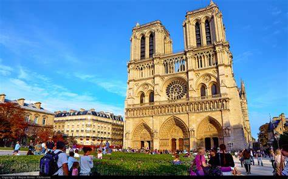
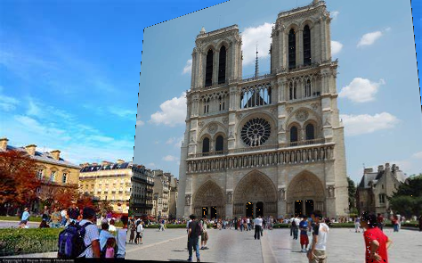
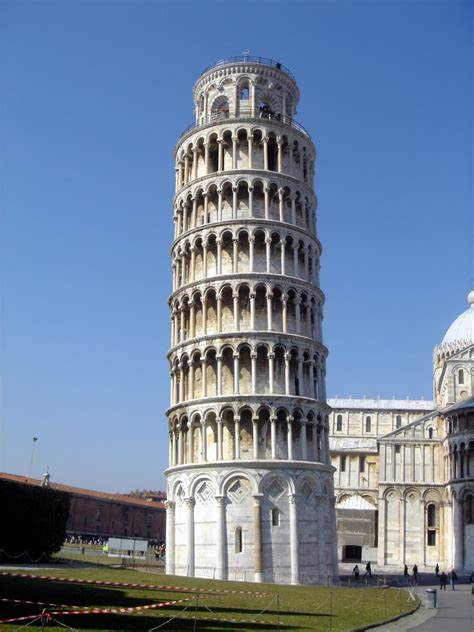
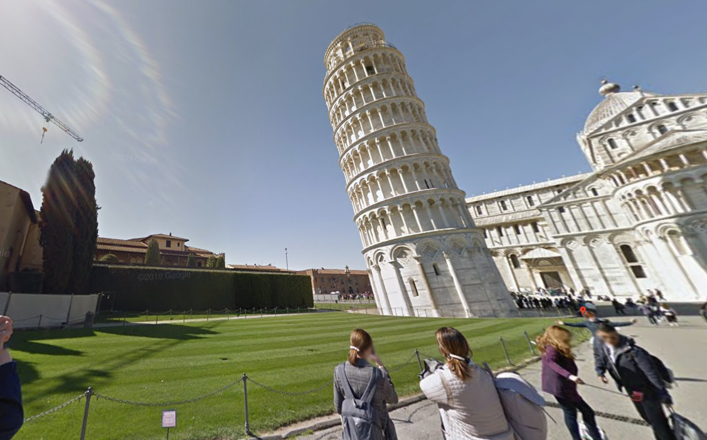
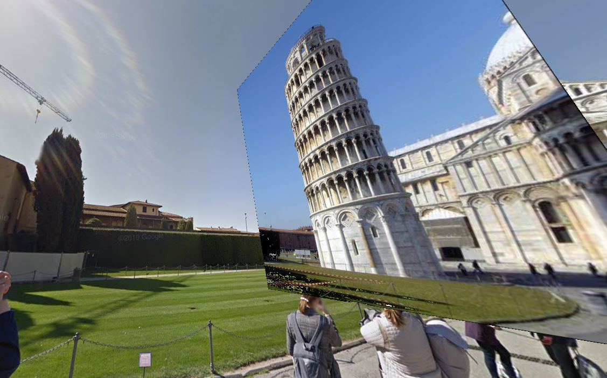
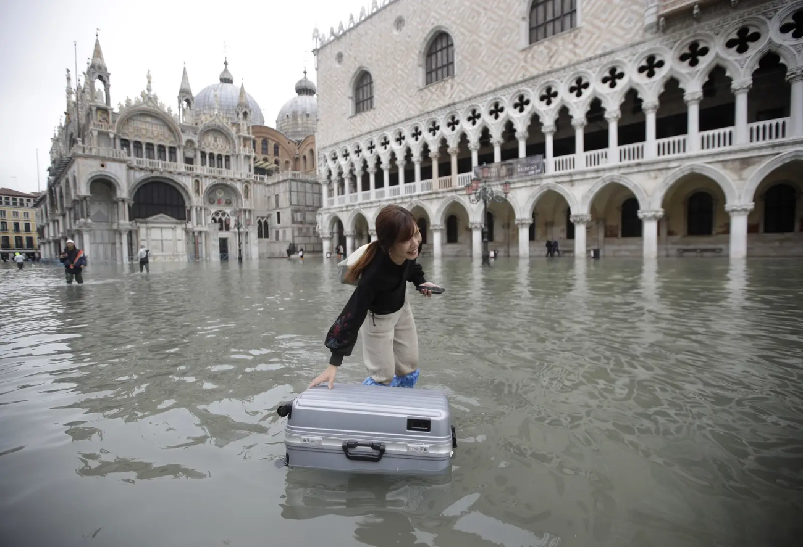
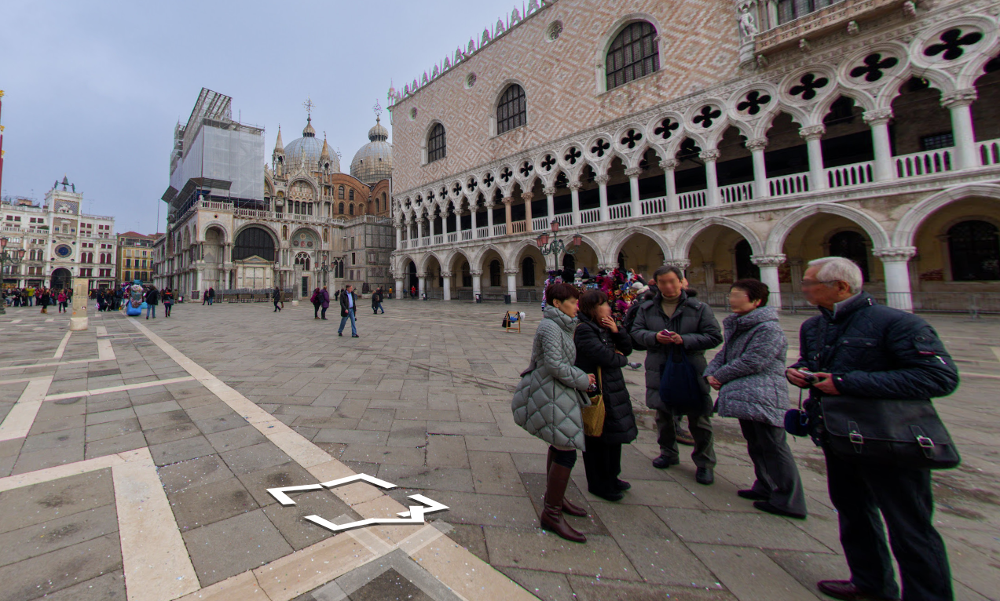
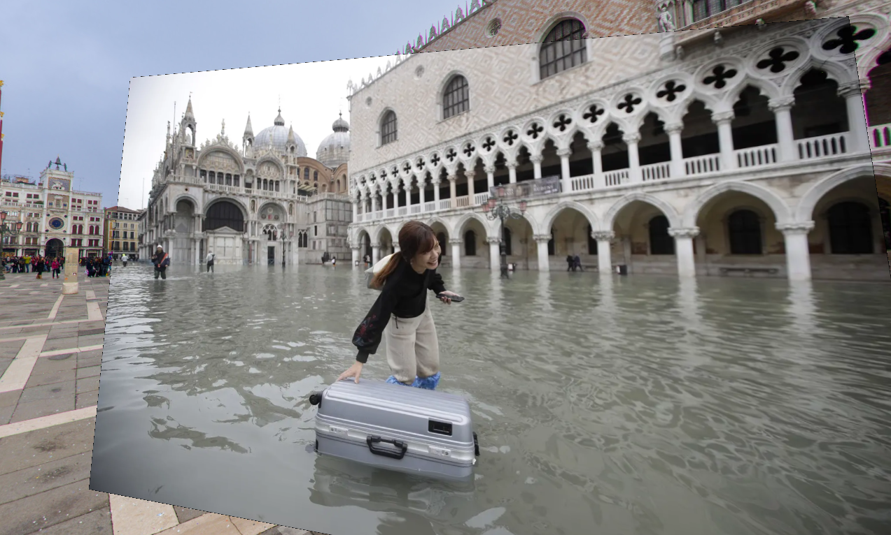

# Crowdsourced Streetview

## Elevate Google Streetview with Real-Time Imagery Updates

### Introduction
Crowdsourced Streetview is a cutting-edge solution designed to enhance Google Streetview with real-time imagery updates. By leveraging the power of crowd-sourced images from social media platforms like Instagram, Twitter, and Facebook, our solution provides timely and accurate visual data. Utilizing OpenCV's advanced image alignment and feature detection algorithms, we align and overlay the crowdsourced images onto existing Streetview data to provide the most current visual representation of streets, landmarks, and neighborhoods.

---

### Key Features
- **Real-time Updates**: No more outdated street views; get the latest visuals from the crowd.
- **Broad Coverage**: Leverage images from multiple social media platforms for comprehensive updates.
- **High Accuracy**: Utilizes OpenCV's image alignment and feature detection for seamless overlays.
- **Natural Disasters**: Be informed about the real-time status of streets during natural calamities.
- **General Photography**: Everyday photos can help update Streetview, making it more dynamic and current.

---

### How It Works
1. **Image Collection**: Source images from Instagram, Twitter, Facebook, etc.
2. **Image Alignment**: Use OpenCV's algorithms to align the crowdsourced image with the existing Streetview data.
3. **Feature Detection**: Detect and match key features between the two images.
4. **Overlay**: Seamlessly overlay the aligned image onto the existing Streetview.
5. **Display**: The updated Streetview is now ready for public viewing.

---

### Examples

#### Example 1
| Crowdsource | Streetview | Result |
|:-----------:|:----------:|:------:|
|  |  |  |

#### Example 2
| Crowdsource | Streetview | Result |
|:-----------:|:----------:|:------:|
|  |  |  |

#### Example 3
| Crowdsource | Streetview | Result |
|:-----------:|:----------:|:------:|
|  |  |  |

---

### Benchmark

Since this is all done on-demand, we must take advantage of modern hardware. Specifically, we find usage of NVIDIA's TensorRT library makes our image alignment run at 19ms, which is tractable! For reference, using normal OpenCV algorithms, the time is expontential by image size and can take up to an hour, while with modern ML algorithms like MagicLeap's SuperPoint, we can do it in 5 seconds. 

| TensorRT SuperPoint | SuperPoint | SIFT |
|:-----------:|:----------:|:------:|
| 19ms | 4.93s | 43m |

---

### Get Involved
Become a part of an effort that aims to make Streetview more dynamic, accurate, and informative. Contribute code and help us build a better visual world!

For more information, reach out at [rl869@cornell.edu](mailto:rl869@cornell.edu).

---
